we sent 5 teams to the 2020 ICPC programming competition. because of COVID, the contest actually happened on march 6th. it was our second year participating! this year, we participated in both division 1 and division 2 in the pacific northwest region. (the hardest region in north america!) the competition lasted for 5 hours. because we were all remote, these are the best competition team photos we could do:

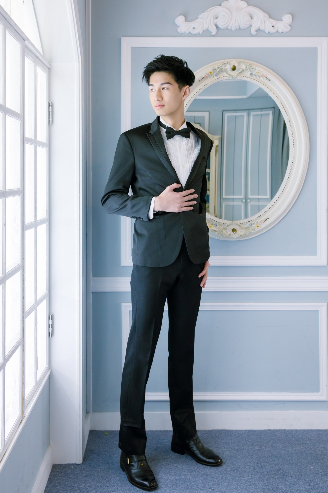

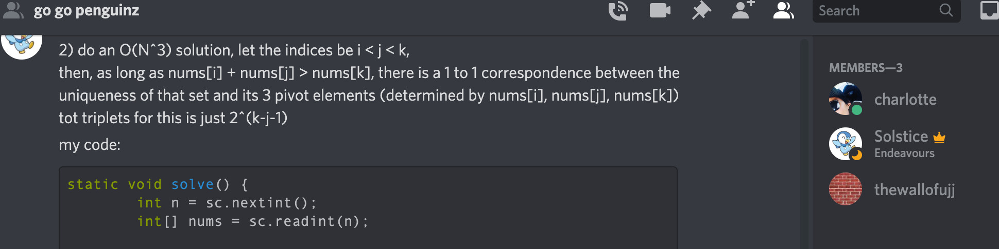

## division 1 teams

### Jerry Lee fan club (20th out of 44 teams)

<strong>Jerry Lee</strong>,

Graduated from SJSU December 2020 - I am currently in the TDP program in Capital One and have a passion in web development and machine learning.

<a href="https://www.linkedin.com/in/jerry-lee1999/">https://www.linkedin.com/in/jerry-lee1999/</a> <a href="https://jerrylee99.com/">https://jerrylee99.com/</a>

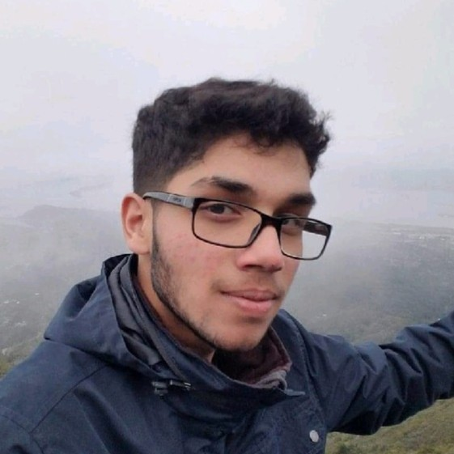

<strong>Habib Sorathia</strong>, Recently graduated Alumni with BS in Computer Engineering. Loves solving challenging problems, playing games, and going on long drives. <a href="https://www.linkedin.com/in/habibsorathia/">https://www.linkedin.com/in/habibsorathia/</a>

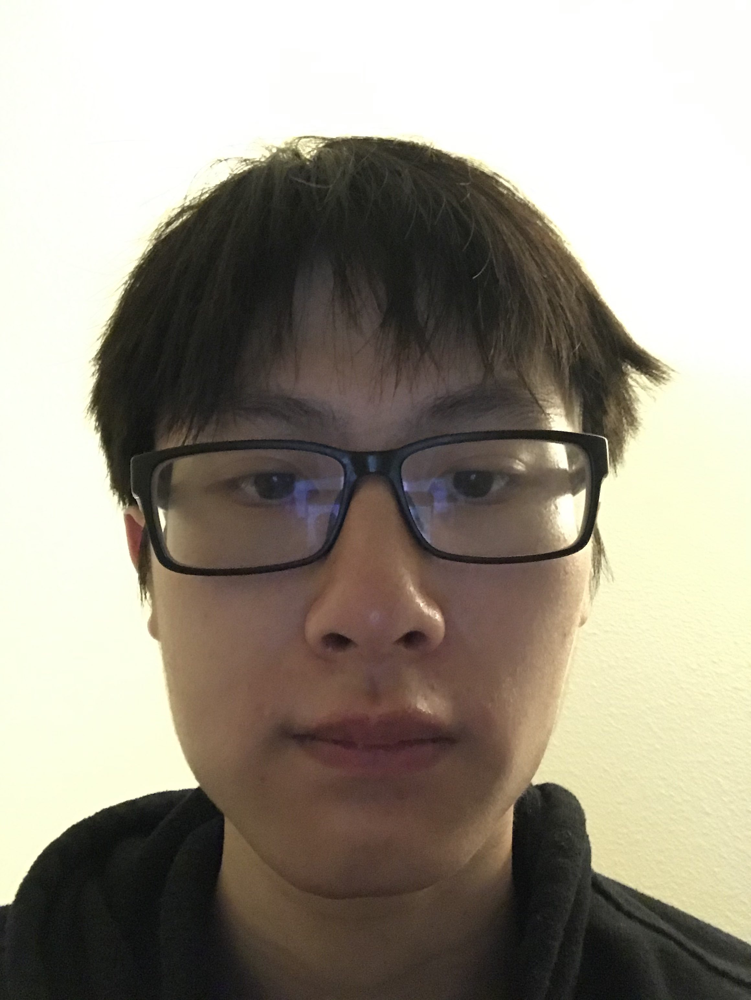

<strong>Davin Wong</strong>, Fourth year CmpE student. I got into programming before high school because I took an interest in how the applications I used were created. Right now, I have interest in mobile development, fullstack, and devops careerwise.

### Pandamonium (23rd out of 44)

<strong>April Chao</strong>, Sophomore, Computer Science - I love climbing, 3D printing, and playing Tetris in my spare time. I'm currently just beginning my endeavors into Computer Science, but some topics that interest me are AI, VR/AR, and machine learning. Furthermore, I'm excited to see what challenges lie ahead in ICPC. <a href="https://www.linkedin.com/in/april-chao-377991163">https://www.linkedin.com/in/april-chao-377991163</a>

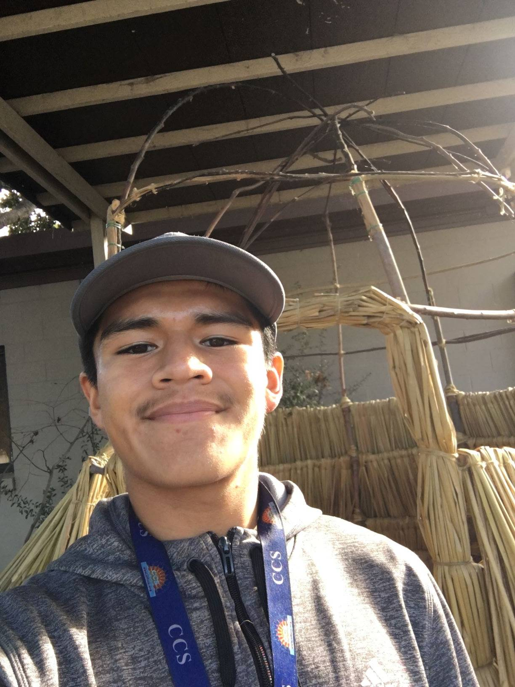

<strong>Azael Zamora</strong>, Junior, Computer Science - Topics that interest me: cyber security, machine learning, AI, networking, and bioinformatics. I enjoy running, cooking, doing practice coding problems in my spare time. Really excited what is in store for me in the programming team.

<a href="https://www.linkedin.com/in/azael-zamora-a4b90a154/">https://www.linkedin.com/in/azael-zamora-a4b90a154/</a>

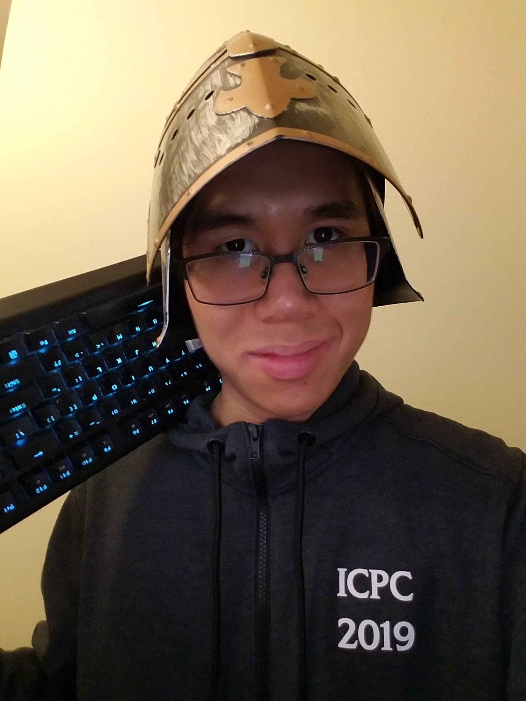

<strong>Minh Pham</strong>, Senior, Computer Science - Programmer. Writer. Rock climber. Video Gamer. Anime enthusiast.

<a href="https://www.linkedin.com/in/mpham1997/">https://www.linkedin.com/in/mpham1997/</a>

### We are who we are (29th out of 44)

Kyle Carter,

<strong>Gabriel Tenocelotl</strong>, Senior, Software Engineering – I like reading, play games and stream on my free time. I am currently pursuing a career in bioinformatics as I enjoy the biological life and computer science. I also love eating food! <a href="https://linkedin.com/in/gabriel-tenocelotl">https://linkedin.com/in/gabriel-tenocelotl</a>

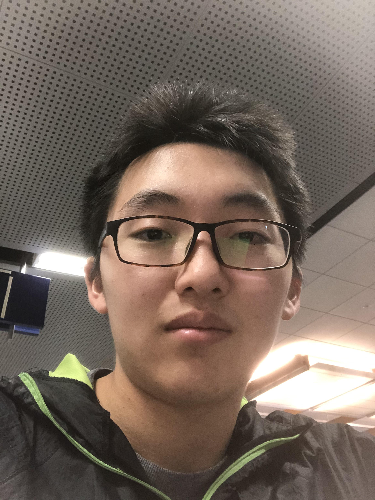

<strong>Ryoki Kunii</strong>,

Junior, Applied and Computational Mathematics - Likes to climb and eat good Japanese food. <a href="https://www.linkedin.com/in/ryoki-kunii/">https://www.linkedin.com/in/ryoki-kunii/</a>

## division 2 teams

### go penguinz (3rd out of 48)

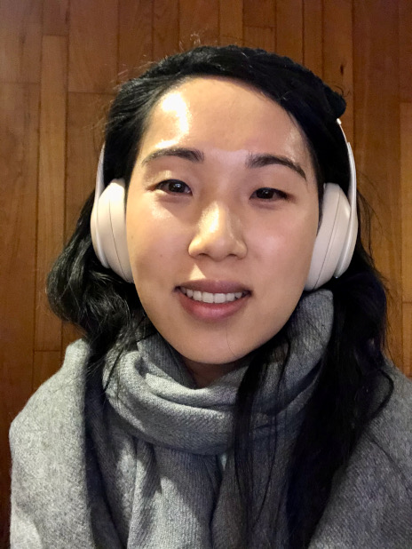

<strong>Charlotte Zhuang</strong>,

Sophomore, Computer Science & Philosophy

loves coding and ~~badminton~~ (lots of coding this year)

<a href="https://www.linkedin.com/in/charlotte-zhuang/">https://www.linkedin.com/in/charlotte-zhuang/</a>

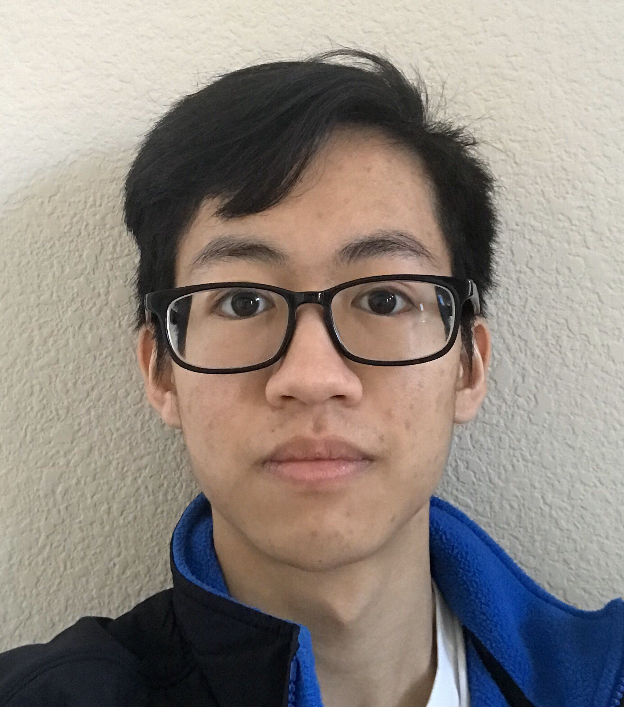

<strong>Kadin Tang</strong>,

Freshman, Computer Science - An ordinary programmer <a href="https://www.linkedin.com/in/kadin-tang-7b54481a5/">https://www.linkedin.com/in/kadin-tang-7b54481a5/</a>

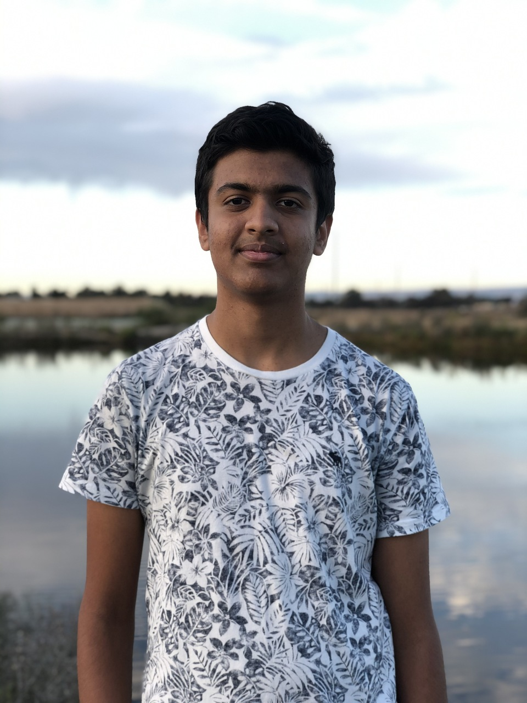

<strong>Ujjwal Nadhani</strong>, Freshman, Computer Science - I'm curious about cryptocurrencies and cybersecurity. I enjoy playing chess and basketball in my spare time. <a href="https://www.linkedin.com/in/ujjwal-nadhani-7662511b4/">https://www.linkedin.com/in/ujjwal-nadhani-7662511b4/</a>

### 11 AM too early (8th out of 48)

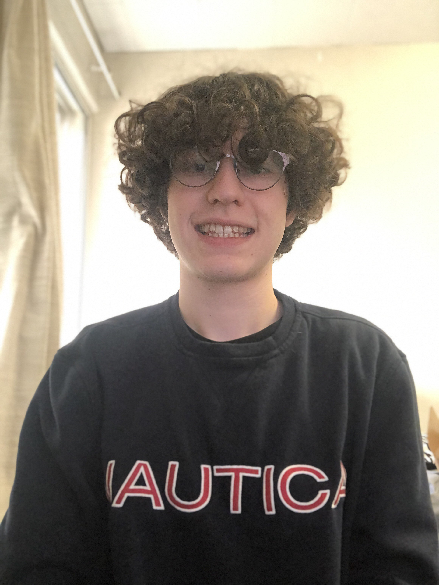

<strong>Dominic Reed</strong>, freshman, computer science I like to do competitive programming and study computer science. Some things I do with my free time is rock climb, play games, and do coding problems. <a href="https://www.linkedin.com/in/dominic-reed-9592741b1/">https://www.linkedin.com/in/dominic-reed-9592741b1/</a>

<strong>Jonathan Wang</strong>, Freshman, Computer Science - I'm interested in AI, ML, and Robotics. Outside of school, I play or create video games, make neat video edits, run, and swim.

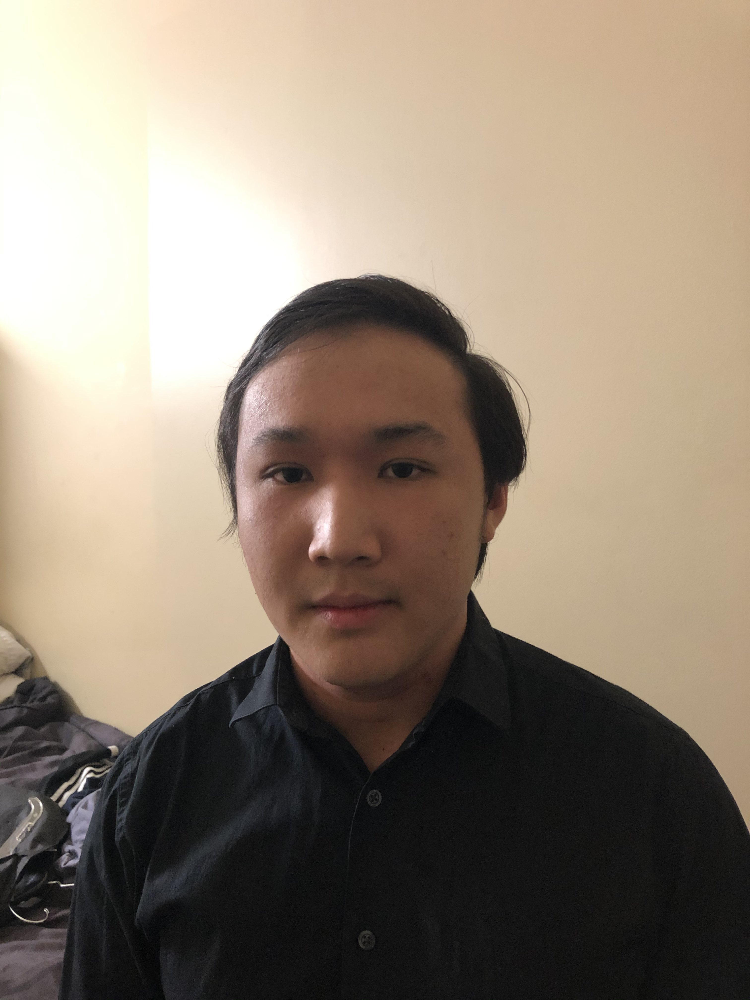

<strong>Sean Widjaja</strong>, Sophomore, Software Engineering

Avid learner in the fields of coding, operating systems, and video game development. I like to play video games and eat in my spare time. <a href="http://linkedin.com/in/sean-widjaja-099aba18b">http://linkedin.com/in/sean-widjaja-099aba18b</a>

