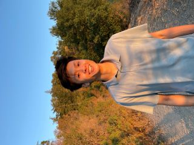

we sent 5 teams to the 2021 ICPC programming competition. because of COVID, the contest actually happened on march 5, 2022. it was our third year participating! this year, all teams participated in division 1 in the pacific northwest region. (the hardest region in north america!) the competition lasted for 5 hours.

## division 1 teams

### SJSU top team: very cool icpc team (21st out of 62 teams)

<strong>Charlotte Zhuang</strong>,

<strong>Dominic Reed</strong>,

<strong>Kadin Tang</strong>,

### rock?ea (33rd out of 62)

<strong>Eunice Oh</strong>,

<strong>Ryoki Kunil</strong>,

<strong>April Chao</strong>,

### january 22nd too early

Jonathan Seang

Yik Haw Teoh

Sean Widjaja

### cooler icpc team

<strong>Allen Tran</strong>

4th year computer science major

I love going on long runs and listening to music.

Still not sure how to write a bubble sort algorithm. Please connect with me on LinkedIn if you want to teach me how: https://www.linkedin.com/in/allentran08

<strong>Rahul Kandekar</strong>,

<strong>Austin Rivard</strong>,

### infinite loop

<strong>Jaime Zuspann</strong>,

<strong>Joshua Lawson</strong>,

