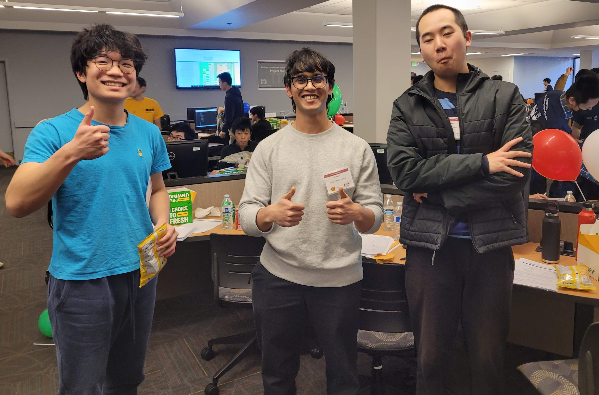
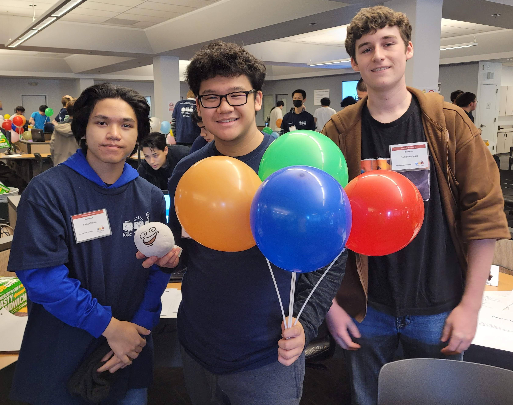
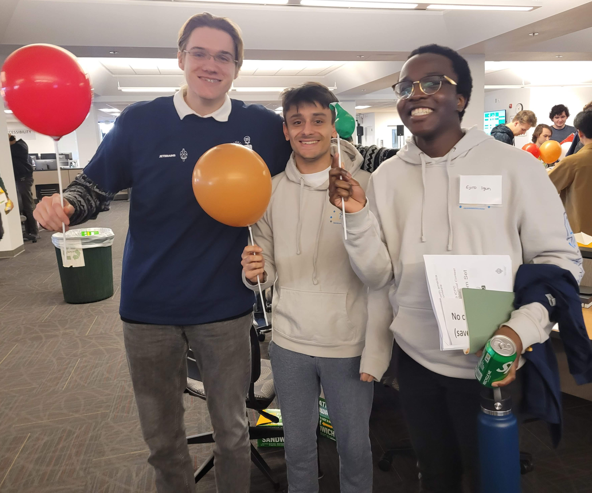

we sent 3 teams to the 2023 ICPC programming competition.

## division 1 teams

### {: .team-photo} 20th/65 RAD

<strong>Raymond Lin</strong>

<strong>Dhiraj Pritham Bomma</strong>

Major: Computer Engineering 
Graduation: Spring 2026 
Hi! I'm Dhiraj, a junior at SJSU. In my free time outside of school and getting "wrong answer" on Codeforces, I enjoy running and reading.

<strong>Austin Chen</strong>

### {: .team-photo} 35th/65 traveling solicitors

<strong>Froilan Zarate</strong>

<strong>Justin Greatorex</strong>

Major: Software Engineering 
Graduation: December 2025 
I have industry experience with Mainframe programming that involves working with low-level debugging and high performance code. I am interested in opportunities within the gaming industry, specifically low-level server code or graphics engine development.

<strong>Theon Olaivar</strong>

### {: .team-photo} 39th/69 topological-turtles

<strong>Mikhail Buka</strong>

<strong>Rowan Pansare</strong>

<strong>Ejiro Igun</strong>

