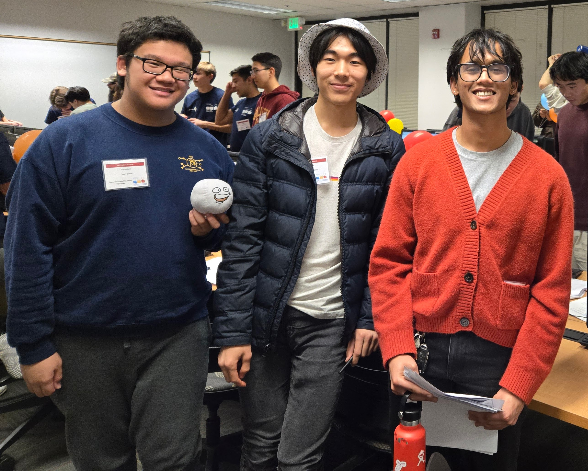
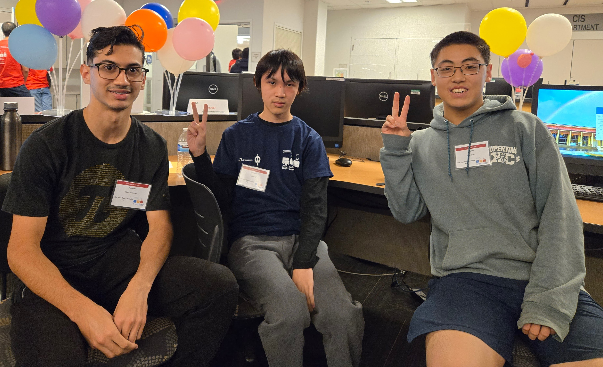
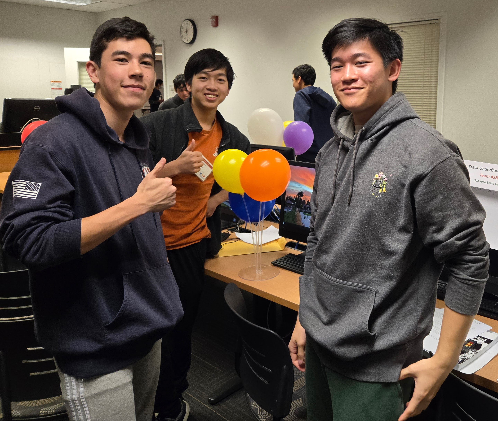
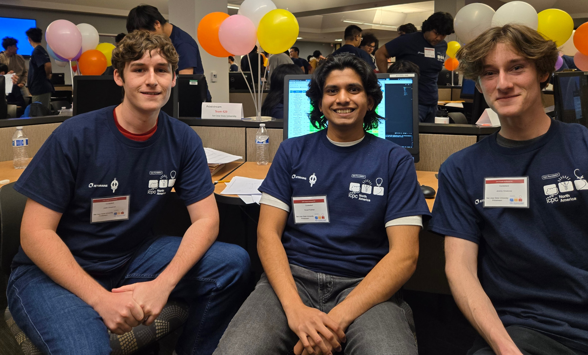
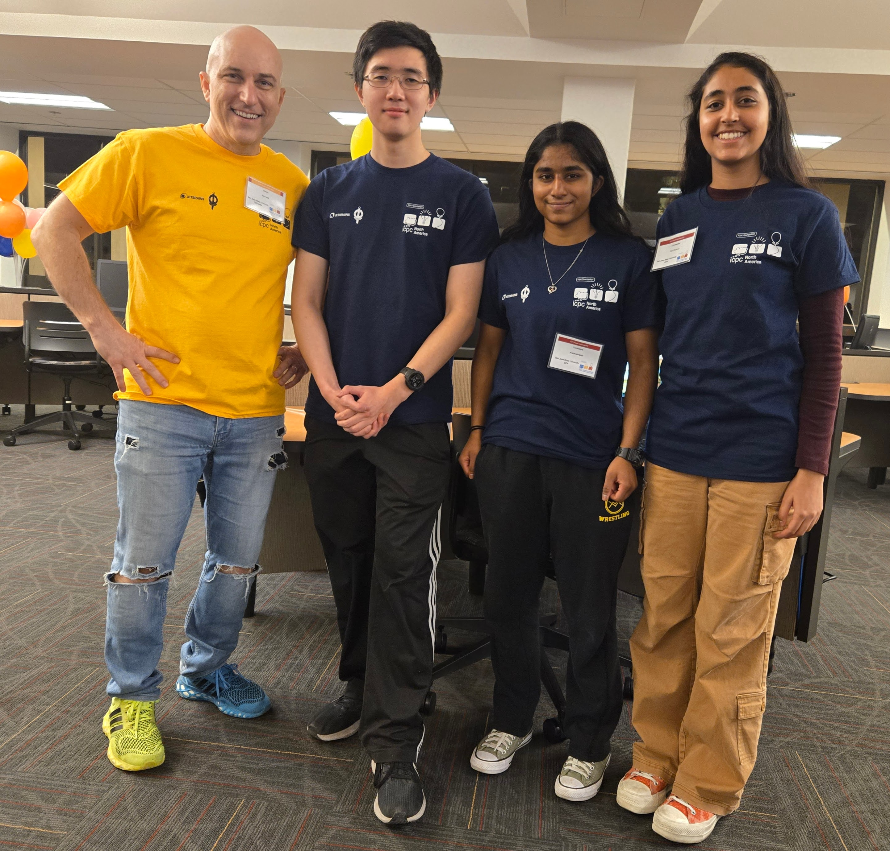

we sent 5 teams to the 2024 ICPC programming competition.

## division 1 teams

### {: .team-photo} 14th/69 TED talks

<strong>Theon Olaivar</strong>

<strong>Eliot Hall</strong>

Major: Computer Science 
Graduation: 2027 
I like solving problems! For fun, I play piano and do ballroom dance. I code too, I guess...

<strong>Dhiraj Pritham Bomma</strong>

Major: Computer Engineering 
Graduation: Spring 2026 
Hi! I'm Dhiraj, a junior at SJSU. In my free time outside of school and getting "wrong answer" on Codeforces, I enjoy running and reading.

### {: .team-photo} 34th/69 AC

<strong>Curtis Zhang</strong>

<strong>Raymond Lin</strong>

<strong>Noah Ruderman</strong>

Major: Computer Science 
Graduation: 2028 
I enjoy solving puzzles and problem solving. I like programming on various platforms. Outside of school, I love hiking and biking.

### {: .team-photo} 39th/69 Stack Underflow

<strong>Andrew Chen</strong>

<strong>Justin Lai</strong>

<strong>Aiden Spies</strong>

### {: .team-photo} 47th/69 Printstring

<strong>Kunal Pradhan</strong>

<strong>Jeremy Greatorex</strong>

<strong>Justin Greatorex</strong>

Major: Software Engineering 
Graduation: December 2025 
I have industry experience with Mainframe programming that involves working with low-level debugging and high performance code. I am interested in opportunities within the gaming industry, specifically low-level server code or graphics engine development.

## division 2 team

### {: .team-photo} 8th/85 EPA

<strong>Edison Fuh</strong>

Major: Computer Science 
I am a 3rd year Computer Science student. My computer science related interests include, but are not limited to, Information Security and Systems Programming. In my free time, I'll usually be playing video games or writing code. My favorite algorithm is probably counting sort, I just think it's neat.

<strong>Anika Manjesh</strong>

<strong>Pari Sharma</strong>

