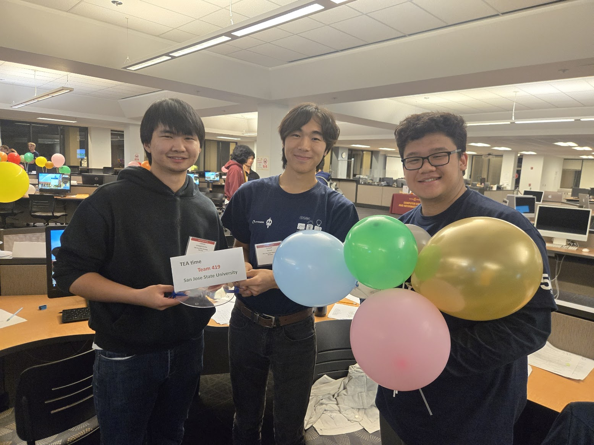

  

    
SJSU · Fall 2026 · ICPC

    <h1>Think. Code. Compete.</h1>
    
Two Saturdays of programming challenges. Get ready for the International Collegiate Programming Contest!

  

  <figure>
    
    <figcaption>SJSU's TEA time team at the 2025 competition.</figcaption>
  </figure>

Join us for two upcoming contests to prepare for **ICPC on Saturday, November 14, 2026**. All times below are **Pacific Time**.

<section class="icpc-2026-event" markdown="1">

## September 26 · Local contest

**Saturday, September 26, 2026** Cash prizes!

- **11:30 a.m.–12:15 p.m. — Warmup:** Practice the contest problem style and learn how to submit solutions.
- **12:30–3:30 p.m. — Contest:** Put your problem-solving skills to the test and compete for cash prizes.

**[Sign up for the local contest](https://docs.google.com/forms/d/e/1FAIpQLSecq9gb6HXNl9qTajww8ARN-jMKEYSIBr1czTQgWpl4_ZjW_g/viewform)**

</section>

<section class="icpc-2026-event" markdown="1">

## October 3 · Regional contest qualifier

**Saturday, October 3, 2026 · 11:00 a.m.–4:00 p.m.**

Compete to qualify for the upcoming ICPC contest. **Spaces are reserved for students who have not yet completed CMPE 126 or CS 146.**

**[Sign up for the regional contest qualifier](https://forms.gle/h5DLoh9rrgjsLCV19)**

</section>

## Next stop: ICPC · November 14

These contests will help you prepare for **Saturday, November 14, 2026**. **Only students who qualify will compete in the November 14 ICPC contest.**

<aside class="icpc-2026-share">
  
  

    <h2>Scan. Save. Share.</h2>
    
Keep the contest schedule handy and invite a friend.

    
<a href="https://ben.homeofcode.com/icpc/2026/">ben.homeofcode.com/icpc/2026/</a>

  

</aside>

[More about SJSU competitive programming](../)
