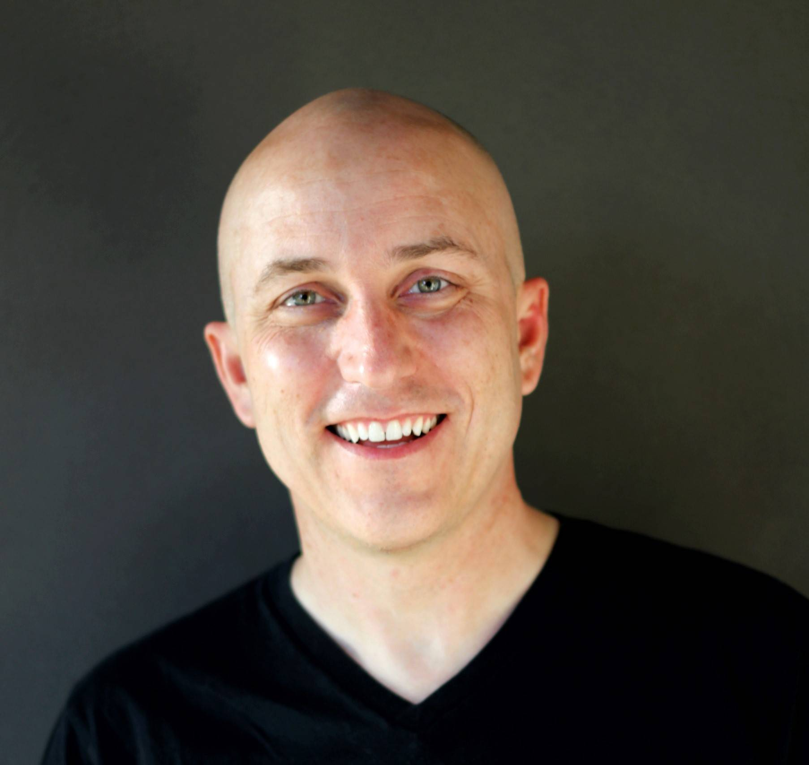

**Prof Dude in Computer Engineering Department**

i work in distributed systems, cloud, big data, networking, storage, and operating systems. i often get asked about [reading lists and blogs, so i started collecting some](distributed-systems/). i love working with grads/undergrads on projects in the area of operating systems and distributed systems. if you want to work with me, please watch <https://www.usenix.org/conference/atc19/presentation/keynote> a great talk by remzi arpaci-dusseau. it has great advice for doing research. you can find out more information about projects that we are working on at [http://www.sjsu.edu/people/ben.reed/systems-group/](systems-group/) (i do not work with students during the summer. internships are too important. if you can't get an internship, try engaging with an open source project. both are more valuable to you than working with a professor during the summer.)
i'm also looking for good (or want to be good) undergraduate programmers to participate [in our programming team](icpc/)!

[checkout the experimental classes i have taught](experimental-courses/).

you can also watch [some videos that i have found interesting in terms of operating systems or university studies](videos/).

<h3>Email</h3>

Preferred: <a href="mailto:ben.reed@sjsu.edu">ben.reed@sjsu.edu</a>

<h3>Telephone</h3>

Preferred: <a href="tel:408 924-5174">408 924-5174</a>

<h3>Office</h3>

ENG 277

### Office hours

* mon,wed: 1:30-2:30
* tues: 3-4:15

### systems research lab hours (in ENG 278 starting Jan 29th)

* tues: 1-4
* fri: 10-4

## Social Media

~~Twitter~~

~~you can follow me on twitter at [@benTheSpartan](https://twitter.com/benthespartan) to be alerted about announcements, changes to office hours, any other exceptional events related to SJSU. the twitter feed will be pretty boring.~~

### Mastodon

you can follow me on mastodon for announcements, changes to office hours, any other exceptional events related to SJSU at [@breed@mas.to tagged with #sjsu](https://mas.to/@breed/tagged/sjsu).

### Threads

you can follow me on threads at [@bcr33d@threads.net](https://www.threads.net/@bcr33d).

### Linkedin

<https://www.linkedin.com/in/bcr33d/>

### Social Media Policy

if you take my class or work on a project with me, i'll connect with you on linkedin. i only connect with students on facebook after they graduate, since it is only then that they realize if they really want to be friends with me :) i don't really use twitter and instagram very occasionally. snap what? i always have discord going, so you can find me there as well.

## Education

- Ph.D. 2000 University of California Santa Cruz, Computer Science.
- M.S. 1993 DePaul University, Chicago, IL, Computer Science.
- B.A. 1987 Miami University, Oxford, OH, Mathematics; Computer Systems minor.

## Licenses and Certificates

car and motorcycle license from california

## Bio

once upon a time a little boy who was born in arizona moved with his family to ohio. he was excited to see snow. after a couple of days waiting for the bus in the snow, his excitement turned to misery. to this day he doesn't like snow. while not suffering in the snow he dreamed of living in "silicon valley" and becoming a professor.

he went to miami university in ohio, spent a brief 2 years in spain, and got his masters at depaul in chicago. fortunately, tuition reimbursement while working in IT at sears and motorola paid for his education at depaul. he loved the midwest and considered himself to be a midwesterner.

he was accepted to UCSC to work on his PhD. he was excited to see the ocean and go to the beach. after arriving in santa cruz, his excitement turned to disappointment when his first trip to the beach consisted of freezing cold water, stinky seaweed, and a naked guy running around. he loved the program at UCSC and ended up getting a position at IBM almaden research center, after an awesome internship there, while he was still finishing up his PhD.

after many years at IBM, he left for yahoo research. it was hard to leave yahoo until they shut down the research division, so it was time for the boy to move on. he saw the things facebook was doing to connect the world, and he wanted to be part of that mission, but ended up going to osmeta, a little startup with some really cool tech and people. as chance would have it, facebook acquired osmeta, and the boy was able to work on really cool stuff at a really cool company that he felt was making the world a better place.

by now the boy had been in california so long and felt so at home here that he considered himself to be a californian.

in 2018, the boy found out that SJSU had an opening in the CS department. he applied and is now part of the CS faculty, and all of his dreams have come true: a faculty position in silicon valley.

the end

if you want the more official/boring version, here is my [CV](docs/cv.pdf).

if you want the sales pitch, here is my [research statement](docs/Research%20Statement.pdf).
